# Inventario Comex — App Android

Aplicación Android nativa (Java) para levantar conteos físicos de inventario en piso de almacén: captura de conteos contra el stock esperado, alta de productos no registrados, resumen con diferencias, exportación de reportes en PDF y consulta del catálogo/stock por presentación.

Es el cliente móvil del backend `inventory-comex` (Spring Boot, repositorio hermano); no incluye lógica de negocio propia más allá de UI y validaciones de formulario — toda la fuente de verdad vive en el servidor.

## Capturas (mockups)

> Las pantallas de abajo son mockups con datos ficticios (SVG, en [`docs/mockups`](docs/mockups)), pensados para documentar el flujo sin depender de un emulador. No son capturas reales de la app.

<table>
  <tr>
    <td align="center">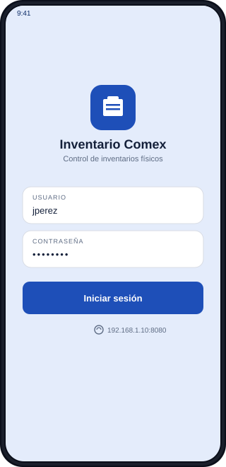<br/><sub><b>Login</b></sub></td>
    <td align="center">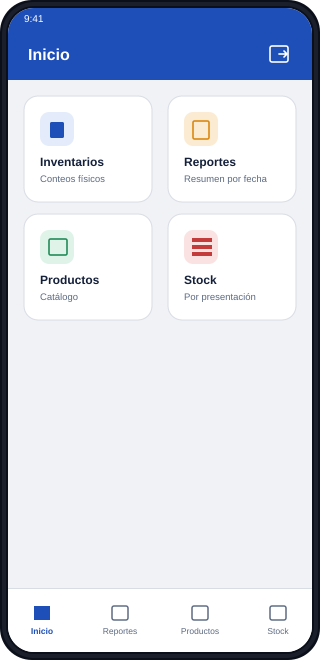<br/><sub><b>Inicio</b></sub></td>
    <td align="center">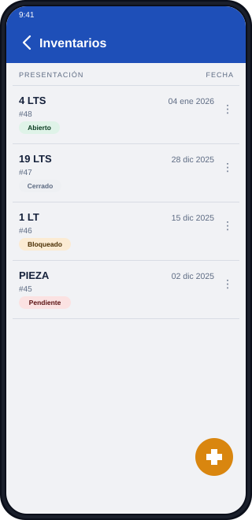<br/><sub><b>Inventarios</b></sub></td>
  </tr>
  <tr>
    <td align="center">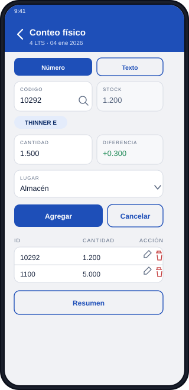<br/><sub><b>Conteo físico</b></sub></td>
    <td align="center">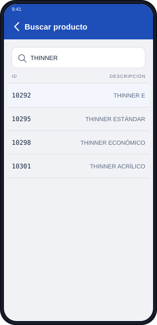<br/><sub><b>Buscar producto</b></sub></td>
    <td align="center">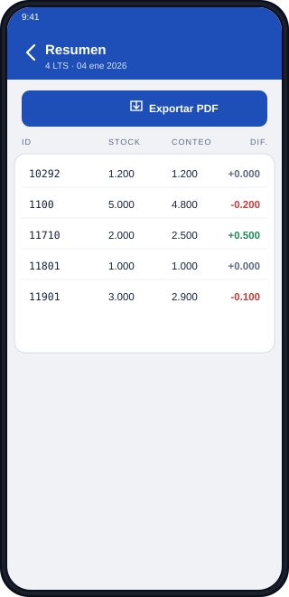<br/><sub><b>Resumen del conteo</b></sub></td>
  </tr>
  <tr>
    <td align="center">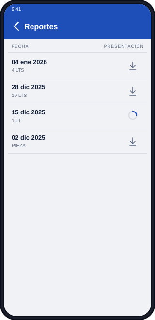<br/><sub><b>Reportes</b></sub></td>
    <td align="center">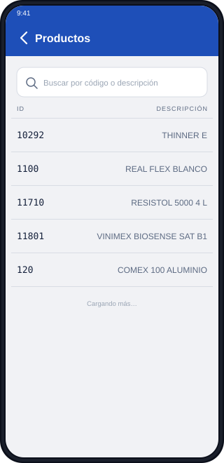<br/><sub><b>Catálogo de productos</b></sub></td>
    <td align="center">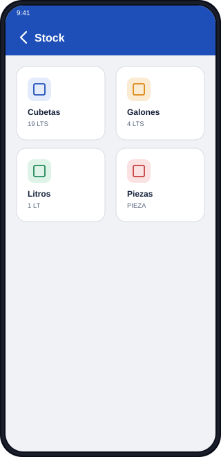<br/><sub><b>Stock por presentación</b></sub></td>
  </tr>
  <tr>
    <td align="center">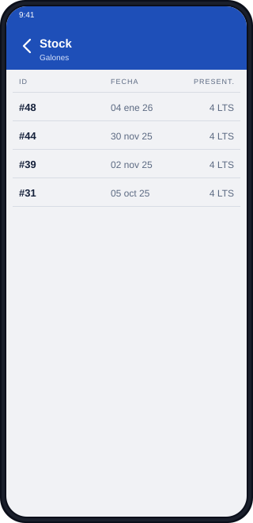<br/><sub><b>Inventarios por tipo</b></sub></td>
    <td align="center">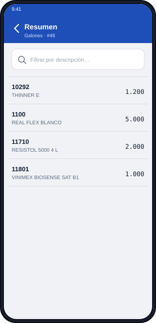<br/><sub><b>Existencias del inventario</b></sub></td>
    <td></td>
  </tr>
</table>

## Funcionalidad

- **Sesión**: login contra el backend (JWT), configuración de servidor (IP:puerto) persistida en el dispositivo, y validación local de expiración del token para redirigir a login automáticamente sin esperar un primer request fallido.
- **Inventarios**: listado paginado con estado (Abierto/Bloqueado/Pendiente/Cerrado), alta desde un CSV, cierre y reapertura, con diálogos de confirmación cuando se intenta abrir un inventario cerrado o bloqueado.
- **Conteo normal**: captura por código (numérico o alfanumérico) con lookup automático de stock/descripción, diferencia en vivo, buscador de productos por nombre para cuando el código del envase es ilegible, y alta de productos encontrados físicamente pero no registrados en el catálogo. La lista de conteos ya registrados se puede filtrar por código o descripción para saber cuántos renglones existen ya de un producto específico, muestra el más reciente primero, y no se oculta detrás del teclado gracias al manejo de insets de `BaseActivity`.
- **Conteo guiado**: recorre el stock del inventario producto por producto.
- **Resumen y reportes**: tabla de diferencias por inventario con exportación/descarga de PDF, y una bitácora de todos los reportes generados.
- **Catálogo de productos**: consulta paginada con búsqueda por código o descripción.
- **Stock por presentación**: navegación Cubetas/Galones/Litros/Piezas → inventarios de ese tipo → existencias de un inventario, con filtro por descripción.

## Arquitectura y stack

- **Lenguaje**: Java, sin frameworks de arquitectura (MVC simple: `Activity` + `Adapter` + capa de red).
- **Red**: Retrofit2 + OkHttp + Gson, con un `AuthInterceptor` que agrega el JWT a cada request.
- **UI**: Material Components (Material 3), `RecyclerView` para listas, `SwipeRefreshLayout` donde aplica.
- **Persistencia local**: `SharedPreferences` (sin base de datos local; la app siempre trabaja contra el backend).

```
app/src/main/java/com/example/myapplication/
├── *Activity.java        # Una Activity por pantalla (Login, Home, Inventarios, Conteo…)
├── BaseActivity.java      # Edge-to-edge (insets) compartido por todas las pantallas
├── adapter/               # RecyclerView.Adapter de cada lista
├── data/                  # SessionPreferences (token/usuario) y ServerPreferences (IP/puerto)
├── network/                # Interfaces Retrofit, DTOs y ApiClient
└── util/                  # Helpers (fechas, JWT, archivos)
```

Cada pantalla que consume datos repite el mismo patrón: valida sesión → pide datos → maneja carga/error/vacío → reacciona a `401` regresando a `LoginActivity`. Es intencionalmente repetitivo en vez de tener una base de Activity con lógica de red, para que cada pantalla sea fácil de leer de forma aislada.

`BaseActivity` sí es una base compartida, pero solo para edge-to-edge: habilita `EdgeToEdge.enable()` y aplica como padding la unión de los insets de `systemBars()` **e** `ime()`. Esto último es necesario porque con edge-to-edge el teclado se dibuja por encima del contenido en vez de encogerlo — sin ese padding extra, cualquier lista o campo que quede debajo del foco se tapa en vez de poder desplazarse por encima del teclado.

## Requisitos

- Android Studio Ladybug (o más reciente) con JDK 17.
- Android SDK con `compileSdk`/`targetSdk` 37 instalado.
- Un dispositivo o emulador con Android 7.0 (API 24) o superior.
- El backend `inventory-comex` corriendo y accesible desde la red del dispositivo (ver [Configuración del servidor](#configuración-del-servidor)).

## Cómo correrlo

1. Clona el repositorio y ábrelo en Android Studio (`File → Open` sobre esta carpeta).
2. Deja que Gradle sincronice las dependencias.
3. Levanta el backend `inventory-comex` (proyecto Spring Boot hermano, en `Backend/Inventories`) y anota la IP:puerto donde escucha (por defecto `8080`).
4. Ejecuta la app en un emulador o dispositivo físico conectado a la **misma red** que el backend.
5. En la primera pantalla de login, toca el pie de página para abrir la configuración del servidor e ingresa esa IP:puerto.
6. Inicia sesión con un usuario existente en el backend.

### Desde línea de comandos

```bash
./gradlew assembleDebug   # genera app/build/outputs/apk/debug/app-debug.apk
./gradlew installDebug    # instala en un dispositivo/emulador conectado
```

## Configuración del servidor

La app no tiene una URL de backend fija en tiempo de compilación: el host y puerto se capturan en pantalla (`ServerConfigActivity`) y se guardan en `SharedPreferences`, junto con un historial corto de servidores recientes para cambiar de red sin volver a escribir la IP. El tráfico es HTTP plano dentro de la red local del almacén (sin dominio ni TLS), por lo que `network_security_config.xml` habilita explícitamente cleartext traffic — si el backend alguna vez queda detrás de HTTPS, ese es el único lugar que hay que tocar.

## Notas de seguridad de la sesión

El JWT se guarda en `SharedPreferences` junto con el usuario. `SessionPreferences.isLoggedIn()` decodifica localmente el claim `exp` del token (sin llamada de red) para saber si ya venció, así que una sesión expirada redirige a login antes de intentar cargar cualquier pantalla, no solo después de que una petición falle con `401`.

## Licencia

Proyecto interno sin licencia pública definida.
